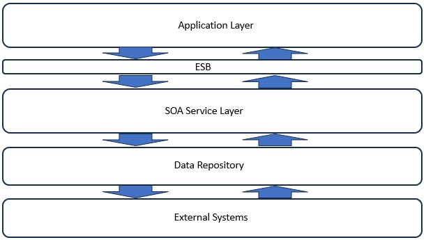

Client access
=============

Context and Problem Statement
-----------------------------
Multiple clients need to access the JFS healthcare tool which will likely be using various styles of their own software tools.

Considered Options
------------------
The following options are being considered:
•	Indirect client access through developed applications
•	Direct access to external systems utilizing COTS channels
Many architectures were narrowed down to two based on the proposed healthcare tool’s premise of connecting data gathered from multiple doctors, pharmacists, insurance companies, and even caretakers. These interactions represent multiple independent services, ideal for a Microservices or Service-Oriented Architecture. 

Decision
--------
Both options were selected. Direct access of external systems is feasible as many COTS products have existing communication channels available and this provides the most seamless method to move the data. It is noteworthy that this method also provides intersystem communications in a more reliable fashion as no user input is necessary. However, while automated communications between COTS systems is ideal, it is not always feasible. For this reason, applications will be required to be developed and integrated independently. 

Consequences
------------
Incorporating multiple options means more complexity and more costs. In some circumstances, the automated process could be accomplished without significant development but will likely not always be the case. Additionally, integration of COTS tools could introduce licensing fees that will endure over the long term.

Supporting Architecture Diagrams
--------------------------------

