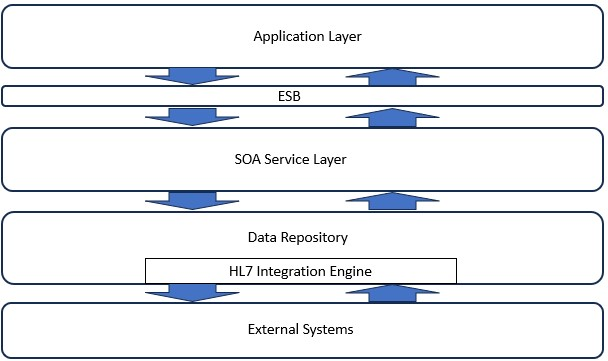

How to optimize interoperability with multiple external healthcare organizations
================================================================================

Context and Problem Statement
-----------------------------
Direct interoperability means optimal integration and operation on many levels. This can be a labor intensive task if no optimal solution can be found.

Considered Options
------------------
The first approach is manual development an interface for each instance of desired interoperability. The second is to utilize existing COTS methods of inter- and intra-system communication among healthcare systems. Finally, an AI-based solution that can learn how to reach and obtain the pertinent data.

Decision
--------
The decision was made to utilize both manual developed applications to interact with external systems and the Health Level 7 (HL7) protocol. The HL7 is an international standard establishing messaging rules between systems that is prevalent in the industry and in continued development by third party developers. Although an automated, standardized approach is desired in all instances, it will not meet all requirements. For instance, patients will not be communicating via this protocol at all as patients in general will not have a healthcare solution at their disposal. Also, standardized protocols are always in development, so changes could require a backup solution be utilized.

Consequences
------------
Integrating multiple methods for clients to incorporate appropriate data into the JFS data repository introduces increased complexity and costs, it is desired to utilize the established solution whenever possible (less development). However, even if only as a backup solution, custom developed client applications will need to be incorporated and planned for. The use of a standardized protocol solution means others will be maintaining and developing it, JFS will be required to evaluate and possible incorporate updates to the proposed healthcare tool as new releases become available and frequently used. Direct inter-system connections means stringent security requirements must be put in place and adhered to strictly as well.

Supporting Architecture Diagrams
-------------------------------- 

